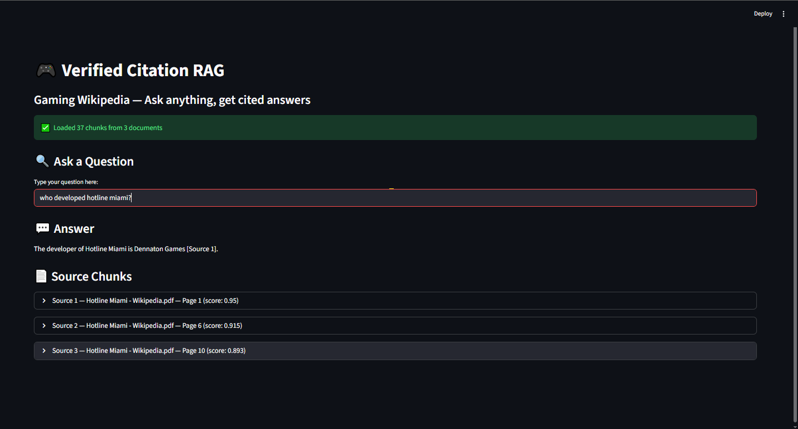
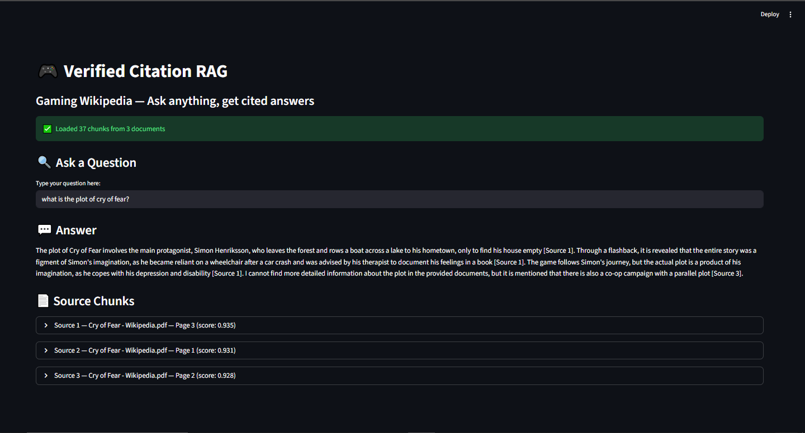
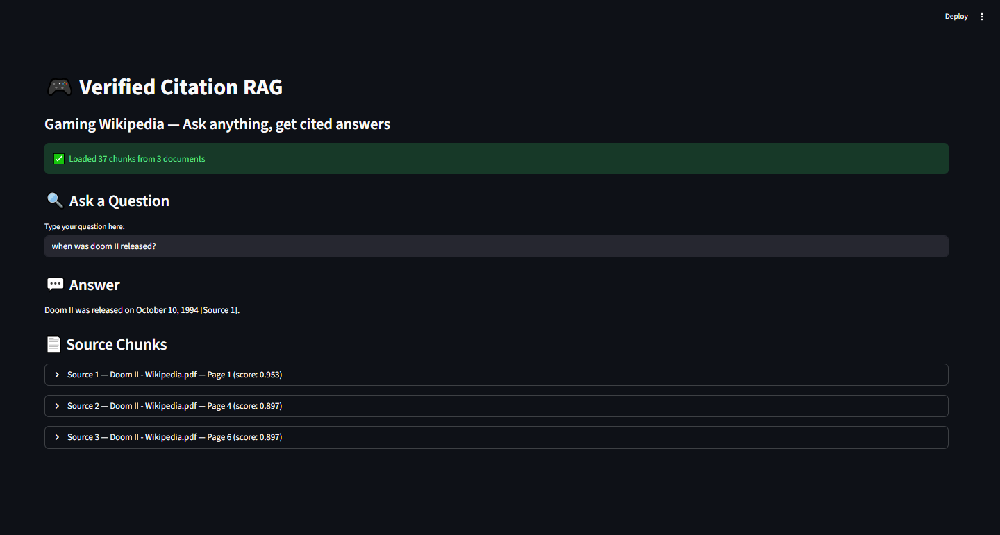

# Verified Citation RAG

A RAG system that answers questions about gaming Wikipedia articles with verified citations.

## What it does
- Parses gaming Wikipedia PDFs into page-level chunks
- Hybrid BM25 + semantic search finds relevant chunks
- Groq LLM generates answers using only retrieved chunks
- Every fact cited with Source X — no hallucinations allowed
- Streamlit dashboard for interactive question answering

## Tech stack
- Python 3.13
- PyMuPDF for PDF parsing
- sentence-transformers for semantic embeddings
- rank-bm25 for keyword search
- Groq API llama-3.3-70b-versatile for answer generation
- Streamlit for dashboard

## Project structure
- parser.py — loads PDFs into chunks
- search.py — hybrid BM25 + semantic search
- generator.py — cited answer generation
- rag.py — complete pipeline
- dashboard.py — Streamlit UI

## How to run
1. Install: pip install pymupdf sentence-transformers rank-bm25 streamlit scikit-learn torch
2. Create .env file with GROQ_API_KEY=your_key
3. Add PDFs to project folder
4. Run: python rag.py
5. Dashboard: streamlit run dashboard.py

## Corpus
- Hotline Miami Wikipedia 21 pages
- Doom II Wikipedia 10 pages
- Cry of Fear Wikipedia 6 pages
- Total 37 chunks

## Screenshots

### Hotline Miami

### Cry of Fear

### Doom II
